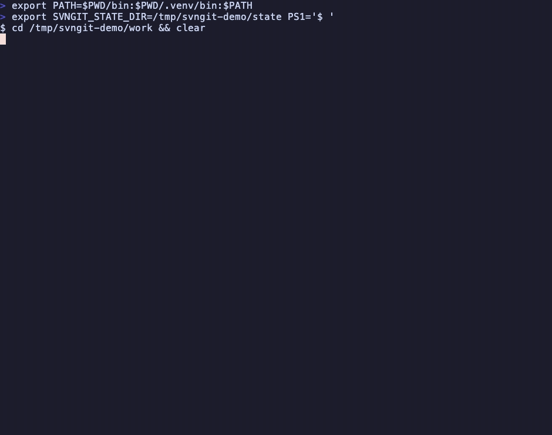
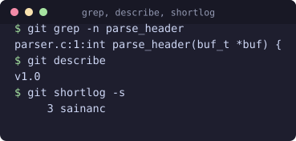
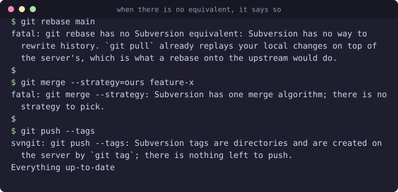
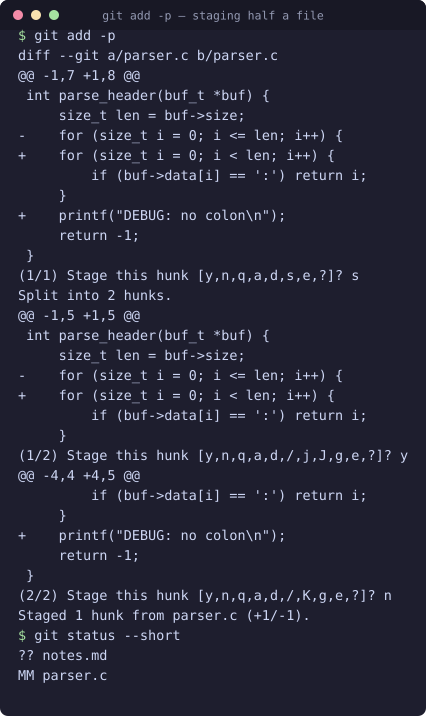

# svngit

**Type git commands. Subversion does the work.**

svngit sits between you and a Subversion working copy. You run `git status`,
`git add`, `git commit`, `git push`. It translates each one into the
equivalent `svn` command, runs it, and prints the result the way git would
have.

<p align="center">
  
</p>

Nothing about the repository changes. Your colleagues keep using `svn`, the
server stays a Subversion server, and there is no mirror or import step.

> Every screenshot in this README is real output, recorded by the scripts in
> [`docs/demo/`](docs/demo/). Nothing here was typed out by hand.

## Contents

- [Is this `git svn`?](#is-this-git-svn) — how they differ, and which to pick
- [Install](#install) — including the `git` shim and shell completions
- [What it covers](#what-it-covers) — all 42 commands
- [How it thinks](#how-it-thinks) — four ideas that explain most behaviour
- [commit and push](#commit-and-push) — the one real workflow difference
- [Staging part of a file](#staging-part-of-a-file) — `add -p`, `add -e`
- [Colour](#colour) — and when it is deliberately withheld
- [Where git and Subversion disagree](#where-git-and-subversion-disagree)
- [Configuration](#configuration) · [Development](#development) ·
  [Status](#status)

## Is this `git svn`?

No. It is worth knowing the difference before you pick one.

**`git svn`** ships with git and builds a *real git repository* that mirrors a
Subversion one. You get genuine git objects, local branches, rebase and
bisect. The cost is an import that can take hours on a large repository, a
`.git` directory holding a second copy of all the history, and
`git svn dcommit` as the only way back to the server.

**svngit** keeps the *Subversion working copy* as the only source of truth and
translates commands as you type them. There is no import, no duplicated
history, and nothing to wait for. The cost is that git features which truly
need git's object model — rebase, bisect, reflog, local-only branches — do not
exist here. They say so when you reach for them.

Use `git svn` if you want git. Use svngit if you have to stay on Subversion
and want your muscle memory back.

## Install

You need Python 3.9+ and the `svn` command-line client. Nothing else — svngit
uses only the standard library.

```bash
pipx install svngit          # or: pip install svngit
brew install svngit          # macOS and Linuxbrew
```

There are also a single-file build that needs no install at all, and native
package recipes for Arch and Debian. See
[docs/INSTALL.md](docs/INSTALL.md) for every route, including which ones have
actually been built and which have not.

That gives you the `svngit` command. To make plain `git` work inside
Subversion checkouts, put the shim directory early on your `PATH`:

```bash
export PATH="$(svngit --shim-path):$PATH"
```

The shim ships inside the package, so that one line is the same however you
installed svngit — pip, pipx, Homebrew, a zipapp or a git checkout.

It is a small script that decides where each invocation goes:

| Where you are | What runs |
| --- | --- |
| Inside a git repository | the real `git`, untouched |
| Inside a Subversion working copy | `svngit` |
| Anywhere else | the real `git` |
| `SVNGIT_DISABLE=1` is set | the real `git`, always |

It walks up from your current directory and takes whichever it finds first,
`.git` or `.svn`. A git repository checked out inside a Subversion tree still
routes correctly. To bypass the shim once:

```bash
SVNGIT_DISABLE=1 git status   # the real git, even in an svn working copy
```

Completions for bash, zsh and fish are generated from the command list
itself, so they never fall behind:

```bash
svngit --completion bash > /usr/local/etc/bash_completion.d/svngit
svngit --completion zsh  > "${fpath[1]}/_svngit"
svngit --completion fish > ~/.config/fish/completions/svngit.fish
```

One exception. An `https://` URL could belong to either system, so the shim
only claims `clone` for URLs that are unmistakably Subversion (`svn://`,
`svn+ssh://`). For anything else, clone explicitly the first time:

```bash
svngit clone https://svn.example.com/repo
```

## What it covers

42 commands, all implemented and tested. The exact `svn` invocation each one
produces is in [docs/COMMANDS.md](docs/COMMANDS.md).

| Area | Commands |
| --- | --- |
| **Working copy** | `clone` `init` `status` `add` `rm` `mv` `restore` `reset` `clean` `sparse-checkout` |
| **History** | `log` `show` `diff` `blame` `shortlog` `describe` `whatchanged` |
| **Search** | `grep` `check-ignore` |
| **Sharing** | `commit` `push` `pull` `fetch` `stash` |
| **Branching** | `branch` `checkout` `switch` `merge` `cherry-pick` `revert` `tag` |
| **Patches** | `apply` `format-patch` `archive` |
| **Tools** | `difftool` `mergetool` |
| **Plumbing** | `config` `remote` `rev-parse` `ls-files` `help` `version` |

The usual short forms work too: `co` `ci` `st` `br` `df` `lg` `cp` `stage`
`unstage` `annotate`.

Three of these are not obvious translations, so they are worth a word:

- **`grep`** has no `svn` counterpart at all. It walks the tree itself and
  skips `.svn`, along with anything unversioned or ignored.
- **`describe`** names a revision after the newest tag copied at or before it.
  A Subversion tag is a directory copy, so the revision it was copied from is
  its history.
- **`apply` and `format-patch`** round-trip with each other, and with git's
  own. The patch svngit writes is converted out of `svn diff`'s header format
  into git's.



### When there is no equivalent

Twenty-four commands cannot mean anything against Subversion. Each one says
what is missing and what to use instead, rather than failing as an unknown
command:



The full list is `rebase` `bisect` `reflog` `submodule` `worktree` `gc` `am`
`notes` `bundle` `range-diff` `rerere` `filter-branch` `fast-export`
`fast-import` `maintenance` `scalar` `backfill` `count-objects` `fsck`
`replace` `gitk` `gui` `citool` `instaweb`.

Individual options get the same treatment:

- **Refused**, with the reason — `git merge --strategy`, `git clone --bare`,
  `git tag --sign`.
- **Accepted but reported**, when the option cannot change anything here —
  `git push --tags`, `git pull --ff-only`.

A test walks every option the parser declares and fails the build on any that
is silently ignored. An option that quietly does nothing is worse than one
that is rejected: you asked for something and believed you got it.

## How it thinks

Four ideas explain most of the behaviour.

**A branch is a directory.** `git checkout feature-x` becomes
`svn switch ^/branches/feature-x`. Creating a branch is a server-side copy, so
it is a commit, and everyone sees it at once. There is no local-only branch.

**git's `HEAD` is Subversion's `BASE`.** This one catches people out. In git,
`HEAD` is your local tip. In Subversion, `HEAD` means the newest revision *on
the server*, and `BASE` is the revision you checked out. svngit maps git's
`HEAD` to `BASE`, and `@{u}` or `origin/HEAD` to Subversion's `HEAD`. So
`git diff HEAD` compares against what you checked out, exactly as it does in
git.

**Revisions stand in for hashes.** Where git prints a sha, svngit prints
`r413`. `HEAD~3` walks back three revisions *that touched the path you asked
about*, because Subversion revision numbers count the whole repository rather
than one file's history.

**The staging area is emulated.** Subversion has no index, so svngit keeps
one. It lives in `~/.local/state/svngit/<checkout>/`, outside the working
copy, along with your unpushed commits and stashes. Keeping it outside means
`svn status` stays clean for everyone else, and none of it can be committed by
accident.

Staging copies the file's content into a local store rather than setting a
flag. That is why editing a file after `git add` shows up as `MM`, and why the
commit records the version you staged.

## commit and push

Git commits locally and pushes later. Subversion commits straight to the
server. svngit bridges that with a queue of local commits, and you pick which
end of the trade you want.

**Deferred (the default).** `git commit` snapshots the staged content and
queues it. Nothing reaches the server. `git push` then replays the queue as
one `svn commit` per local commit, so two local commits become two revisions
with their own messages. `git reset --soft` un-commits the last queued one.

```bash
git config svngit.commitmode deferred
```

**Immediate.** `git commit` runs `svn commit` there and then, and `git push`
reports that there is nothing to do. This is closer to what your
Subversion-using colleagues see happening.

```bash
git config svngit.commitmode immediate
```

### What push protects you from

Replaying rewinds each file through every queued commit's content in turn. So
before it starts, push snapshots everything the queue touches, and restores it
at the end. Any edit you made after your last `git commit` is still there when
the push finishes.

Push also refuses to run when the server has moved ahead, and tells you to
`git pull` first. If a commit midway through the queue is rejected, the ones
already accepted leave the queue and the rest stay in it.

## Staging part of a file

`git add -p` and `git add -e` both work. The emulated index stores content
rather than a flag. Staging part of a file writes a version that matches
neither the last commit nor the file on disk, and everything downstream
already knows how to read that.



`-p` takes git's full answer set: `y n q a d s e j J k K g / ?`. You can move
between hunks, jump to one by number, or search for one by regex. The prompt
offers only the moves that exist from where you are.

`e` opens the current hunk alone in `$EDITOR`; `-e` opens the whole diff
instead. Both can stage text that was never on disk, which is the point of
editing a patch. Hunk headers are recalculated on the way back in, so you
never need to fix the `@@` counts by hand. An edit that does not apply is
refused — `-p` puts you back in the editor, `-e` stages nothing at all.

`git add -N` records a new file with empty content. That is what lets `-p`
pick hunks out of a file git has never seen. It is not committed until you
stage it properly, and `git commit` says so rather than committing an empty
file.

## Colour

Diffs, patches, `add -p` hunks and `git status` are coloured the way git
colours them: added lines green, removed red, hunk headers cyan, file headers
bold, and in status a staged path green against an unstaged or untracked one
in red.

Colour appears only when the output is a terminal. That is not a cosmetic
choice — `git diff > patch.txt` has to produce a file that `git apply` can
read, and `git status --porcelain` has to stay machine-readable. Escape codes
are added at the moment text is printed, so the patch handed to `$EDITOR` by
`git add -e` and the files written by `git format-patch` never carry any.

To override:

```bash
git diff --color          # force it on, even into a pipe
git diff --no-color       # force it off
git config color.ui never # off for good
NO_COLOR=1 git diff       # the environment convention, also honoured
```

## Where git and Subversion disagree

### Merges commit immediately

Merges, cherry-picks and reverts commit directly to Subversion, whatever
`commitmode` says. The reason is `svn:mergeinfo`: a property Subversion writes
on the working copy root to record what has been merged. If it is not
committed along with the merge, Subversion will happily merge the same
revisions again later.

Because the merge commit includes that root property, these commands refuse to
run while you have unpushed local commits. Push first.

### `git revert` is not `svn revert`

`git revert` creates a new revision that undoes an old one, which is a reverse
merge (`svn merge -c -N`). That is git's meaning of the word.

Subversion's own `svn revert` throws away local edits. That is `git restore`
here, or `git checkout --`.

### stash is entirely local

`git stash` is an `svn diff` plus an `svn patch`, kept in the local store.
Nothing touches the server.

`git stash -p` picks hunks with the same prompt as `git add -p`, but the sense
is inverted. A hunk you accept is taken *out* of your working copy and saved.
One you decline stays put.

It compares against your last commit rather than the index, because a stash
saves staged work too. `pop` merges three ways, so a file you kept working on
is not clobbered.

### fetch can list but not download

`git fetch` shows the revisions waiting on the server. It cannot download
them, because a Subversion working copy has nowhere to keep revisions it has
not applied yet. `git pull` applies them.

### An unpushed commit still counts

Subversion calls a file modified until it is pushed. svngit does not:
`git status`, `git diff` and `git add -p` all treat a queued local commit as
committed. A hunk you have already committed locally is not offered to you a
second time.

## Configuration

Settings live per working copy. Read and write them with `git config`.

| Key | Default | Meaning |
| --- | --- | --- |
| `svngit.commitmode` | `deferred` | `deferred` or `immediate` (see above) |
| `svngit.trunk` | `trunk` | Trunk directory name |
| `svngit.branches` | `branches` | Branches directory name |
| `svngit.tags` | `tags` | Tags directory name |
| `svngit.layout` | probed once | `standard` or `flat`, cached after the first probe |
| `svngit.checkupstream` | unset | `true` lets `git status` ask the server how far behind you are. Costs a network round trip per status. |
| `svngit.quiet` | unset | `true` silences the explanatory notes |
| `color.ui` | `auto` | `always`, `never` or `auto`. `auto` colours only when output is a terminal. |
| `color.diff` | follows `color.ui` | Colour for diffs, patches and `add -p` |
| `color.status` | follows `color.ui` | Colour for `git status` |
| `user.name` | your login name | Author recorded on queued commits |

Environment variables:

| Variable | Effect |
| --- | --- |
| `SVNGIT_SVN` | Path to the `svn` binary |
| `SVNGIT_STATE_DIR` | Where the index, commit queue and stashes are kept |
| `SVNGIT_TRACE=1` | Print every `svn` command as it runs |
| `SVNGIT_DISABLE=1` | Bypass the `git` shim |

## Seeing what it does

Two global options make the translation visible. They are useful both for
learning Subversion and for filing a bug:

```bash
git --trace status      # print every svn command as it runs
git --dry-run push      # print the svn commands that would change something
```

## Development

```bash
python3 -m venv .venv && .venv/bin/pip install -e '.[dev]'
.venv/bin/python -m pytest
```

The suite has two halves.

**Unit tests** use a recording client that replaces the subprocess call. They
assert the exact `svn` argv each git command produces, which is the contract
of a translation layer. The whole set runs in well under a second.

**Integration tests** in `test_integration.py` build a real repository over
`file://` and check the resulting repository state. They skip themselves when
`svn` and `svnadmin` are missing, so install Subversion before trusting a
green run:

```bash
brew install subversion     # macOS
apt install subversion      # Debian/Ubuntu
```

To rebuild the images in this README:

```bash
sh docs/demo/make.sh        # the GIF (needs vhs and ffmpeg)
sh docs/demo/capture.sh     # capture real output for the stills
```

To build the distributable artefacts:

```bash
python -m build                        # wheel and sdist
sh packaging/make-zipapp.sh            # single-file dist/svngit.pyz
sh packaging/homebrew/test-local.sh    # build and test the Homebrew formula
```

## Status

Alpha. All 42 commands are implemented, and the whole clone → add → commit →
push → branch → merge cycle runs end to end against a real Subversion
repository in the test suite.

What that does **not** cover: a large real-world repository, a network server
(the tests use `file://`), authentication, externals, unusual layouts, and
merge-heavy histories. Treat `--dry-run` and `--trace` as your friends on
first contact with a repository that matters.

## License

MIT. See [LICENSE](LICENSE).
